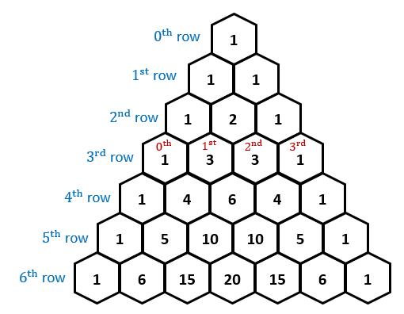

# Problem: https://leetcode.com/problems/pascals-triangle/



## solution:

- Tạo một array = []
- nếu numRows >= 1 => array.push([1])
- nếu numRows >= 2 => array.push([1,1])
- Hiện tại array = [ [1] , [1,1] ]
- Sau đó ta sẽ dùng for bắt đầu từ i = 2. trong vòng lặp
- Đặt thêm 2 biến: let first = 1; let last = 1; => bởi vì đầu và cuối luôn luôn là 1
- Và đặt thêm biến : let prevArr = \array[i - 1]; => để lấy ra length của array trc đó so sánh vơi right để dùng while
- Nếu prevArr.length === 2 thì push => \array.push([first, first + last, last]); => array lúc này = [ [1], [1,1] , [1,2,1] ]
- Bắt đầu từ những vong tiếp theo ta dùng while => right < prevArr.length
- Đặt thêm 3 biến cờ let left = 0; let right = 1; let add = [];
- Nếu right < prevArr.length

```js
while (right < prevArr.length) {
  add.push(prevArr[left] + prevArr[right]);
  left++;
  right++;
}
```

- Sau đó push vào array : array.push([first, ...add, last]);
- Và tiếp tục vong while cho tới khi thỏa điều kiện
